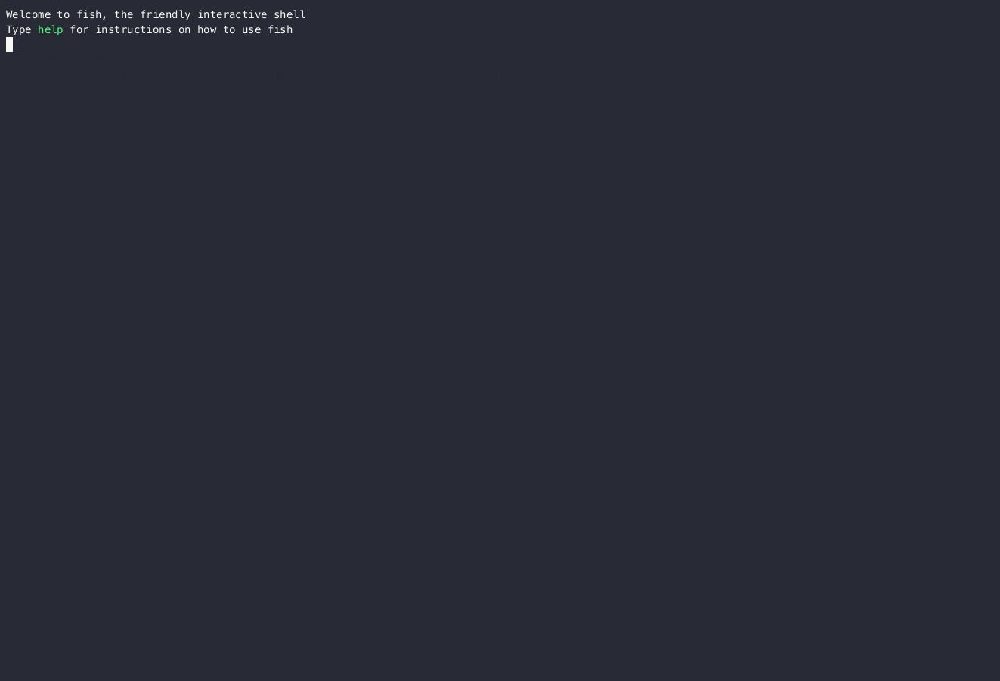

# Renovate: A new way to handle Postgres schema migration

Database schema designs will evolve over time as the products they support evolves. It is important to be able to migrate the schema in a safe and reliable manner to incorporate the product changes.

Traditionally,  migration systems like ActiveRecord or sqlx will allow you to write migration files to describe what you want to execute to move the database from the current state to a new state. The system will track what migration files were applied by using a migration table like this:

```sql
CREATE TABLE public._sqlx_migrations (
    version bigint NOT NULL PRIMARY KEY,
    description text NOT NULL,
    installed_on timestamp WITH time zone DEFAULT NOW() NOT NULL,
    success boolean NOT NULL,
    CHECKSUM bytea NOT NULL,
    execution_time bigint NOT NULL
);
```

This approach is reliable but it defers the burden of writing migration scripts to the developers. Sometimes the migration scripts are not easy to write, especially when the schema is complex. It is also hard to review the migration scripts since the reviewers need to understand what the current state is and what the new state it wants to achieve.

Newer migration systems like [atlas](https://github.com/ariga/atlas) can *understand* database schemas and generate migrations for you. To achieve this, normally the system needs to know the local state that users want to transit to and the remote state that is currently running in the database. Once the system gathered both states, it could *diff* them to understand what changes are needed. This approach is widely used by the tools to manage cloud resources, for example, [terraform](https://www.terraform.io/). It is more convenient for developers, and tools like terraform proved their value.

Renovate is a tool that falls into the second category. Unlike atlas, it doesn't use a new language (say HCL) to describe the local state. Instead, it uses the existing SQL DDL to describe the state. You could use `renovate schema init` to start a new project from an existing database. Renovate will retrieve the schema (if any) from the database server. And this will be your local state. You can do whatever modifications you'd like to do to it. Then you can use `renovate schema plan` to get the migration plan. Renovate will use `pg_dump` to retrieve the remote state from the database server, and then diff the AST between the local state and the remote state to find out the right migration plan.

Then it can generate the migration scripts to move the database from the remote state to the local state. This approach is more convenient for developers, but it is not reliable. The system needs to understand the schema, and it is hard to make sure the system can understand all the possible schema changes. It is also hard to review the generated migration scripts since the reviewers need to understand what the system is trying to do.


Below is an example:


Example:

```console,ignore
➜ renovate schema init postgres://localhost:5432/test
➜ cat public/tables.sql
CREATE TABLE public.todos (title text, completed boolean);⏎
➜ cat > public/tables.sql
CREATE TABLE public.todos (title text, completed boolean, created_at timestamptz default now());
➜ renovate schema plan
Table public.todos is changed:

1        |-CREATE TABLE public.todos (title text, completed boolean)
    1    |+CREATE TABLE public.todos (
    2    |+    title text,
    3    |+    completed boolean,
    4    |+    created_at timestamptz DEFAULT NOW()
    5    |+)

The following SQLs will be applied:

  ALTER TABLE public.todos ADD COLUMN created_at timestamptz DEFAULT NOW();
```

If that inspires you, here's a more detailed demo:



WARNING: This project still lacks many features. It is not ready for production use yet. Please be noted some of the generated migrations (e.g. changing fields in composite type) are not safe to apply at this moment. If you have better ideas on how those migrations should be, please submit an issue.

## How it works

Under the hood, Renovate uses [pg_query](https://github.com/pganalyze/pg_query.rs) to parse the Postgres SQL DDL to AST and uses [pg_dump](https://www.postgresql.org/docs/current/app-pgdump.html) to retrieve the remote state from the database server. The below figure shows the workflow of Renovate:


For more information, see the [initial thoughts](./rfcs/0001-sql-migration.md). Or you can also check the [architecture](./docs/architecture.md).

## Installation

Currently, Renovate only support installation from source:

```console,ignore
$ cargo install renovate
```

## Renovate CLI

```console
$ renovate schema
? 2
renovate-schema[..]
Schema migration

USAGE:
    renovate schema [OPTIONS] <SUBCOMMAND>

OPTIONS:
        --drop-on-exit    drop database on exit (for testing purpose only)
    -h, --help            Print help information

SUBCOMMANDS:
    apply        apply the migration plan to the remote database server
    fetch        fetch the most recent schema from the remote database server
    help         Print this message or the help of the given subcommand(s)
    init         init a database migration repo
    normalize    normalize local schema via a temp local database
    plan         diff the local change and remote state, then make a migration plan

```

## What has been supported

- [x] Type
  - [x] composite type add/remove
  - [ ] composite type change (destructive change only)
  - [x] enum type add/remove
  - [x] enum type add values
  - [x] enum type rename value (limited 1 rename at a time)
  - [ ] enum type change values (destructive change only)
- [x] Table
  - [x] column add/remove
  - [x] column type change
  - [x] column constraint change (default, not null, unique, check)
  - [x] table constraint add/remove/change
  - [x] table index add/remove/change
  - [x] table trigger add/remove/change
  - [x] table RLS
  - [x] table policy add/remove/change
  - [x] table owner change
- [x] View add/remove/change
- [x] Materialized view add/remove/change
- [x] Function add/remove/change
- [x] Sequence add/remove/change
- [x] Privilege add/remove/change

## FAQ

Q: How to use Renovate to rollback my schema change?

A: Unlike traditional schema migration tools, Renovate doesn't have a concept of "rollback". You could just change the schema back to the desired state (e.g. `git reset`), and then run `renovate schema plan` to get the migration plan as usual. Then you could apply the migration plan to the remote database server.

Q: what if my change to the schema is not supported?

A: Please submit an issue to let us know. We will try to support it as soon as possible. Meanwhile, you could manually apply that change to the remote database, then run `renovate schema fetch` to update the local state.

Q: Can I use Renovate as a library?

A: Yes, you can include it as a dependency in your project. Please exclude `cli` feature if you just want to use the core. But it is not recommended to use it as a library at this moment. The API is not stable yet.

Q: What is the plan or roadmap for Renovate?

A: I don't have a roadmap now. I need to get as much feedback as possible from you. My priority, for now, is to make it stable and reliable. The project has a decent number of unit tests (57 unit tests + 1 CLI test) at the time of writing, but it still lacks coverage for many scenarios. I haven't produced any user guide yet, and it is important.
