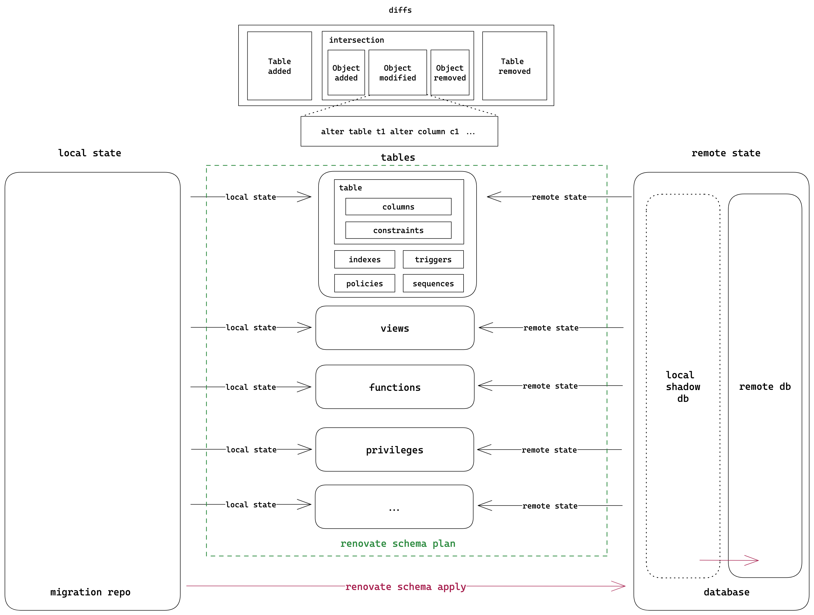

# Renovate: A new way to handle Postgres schema migration

WARNING: This project still lacks many features. It is not ready for production use yet. Please be noted some of the generated migrations are not safe to apply at this moment. If you have better ideas on how those migrations should be, please submit an issue.

Renovate is a CLI tool to help you to work on Postgres schema migration easily.

Example:

```console,ignore
➜ renovate schema init postgres://localhost:5432/test
➜ cat public/tables.sql
CREATE TABLE public.todos (title text, completed boolean);⏎
➜ cat > public/tables.sql
CREATE TABLE public.todos (title text, completed boolean, created_at tstz default now());
➜ renovate schema plan
Table public.todos is changed:

1        |-CREATE TABLE public.todos (title text, completed boolean)
    1    |+CREATE TABLE public.todos (
    2    |+    title text,
    3    |+    completed boolean,
    4    |+    created_at tstz DEFAULT NOW()
    5    |+)

The following SQLs will be applied:

  ALTER TABLE public.todos ADD COLUMN created_at tstz DEFAULT NOW();
```

## How it works

Renovate is inspired by [terraform](https://www.terraform.io/). It also tries to generate migration declaratively, not imperatively. Terraform invented a new language to describe the resources, but renovate decides to just use the existing SQL DDL to do so. It is a bit tricky to generate the migration from the SQL DDL, but it is much easier to understand and maintain.

Under the hood, renovate uses [pg_query](https://github.com/pganalyze/pg_query.rs) to parse the postgres SQL DDL, and use [pg_dump](https://www.postgresql.org/docs/current/app-pgdump.html) to retrieve the remote state. After a renovate repo is created (by calling `renovate schema init`), it will keep track of the local state and the remote state. When you run `renovate schema plan`, it will retrieve the local state from the repo and the remote state via `pg_dump`, then parse both as AST using pg_query, and compare the two ASTs to generate the migration. Below figure shows the workflow of renovate:



For more information, see the [initial thoughts](./rfcs/0001-sql-migration.md). Or you can also check the [architecture](./docs/architecture.md).

## A simple demo

[](https://asciinema.org/a/N7Pd3gDPGFcpCddREJKAKTtbx)

## Installation

Currently, renovate only support install from source:

```console,ignore
$ cargo install renovate
```

## What has been supported

- [x] Type
  - [x] composite type add/remove
  - [ ] composite type change (destructive change only)
  - [x] enum type add/remove
  - [x] enum type add values
  - [x] enum type rename value (limited 1 rename at a time)
  - [ ] enum type change values (destructive change only)
- [x] Table
  - [x] column add/remove
  - [x] column type change
  - [x] column constraint change (default, not null, unique, check)
  - [x] table constraint add/remove/change
  - [x] table index add/remove/change
  - [x] table trigger add/remove/change
  - [x] table RLS
  - [x] table policy add/remove/change
  - [x] table owner change
- [x] View add/remove/change
- [x] Materialized view add/remove/change
- [x] Function add/remove/change
- [x] Sequence add/remove/change
- [x] Privilege add/remove/change
